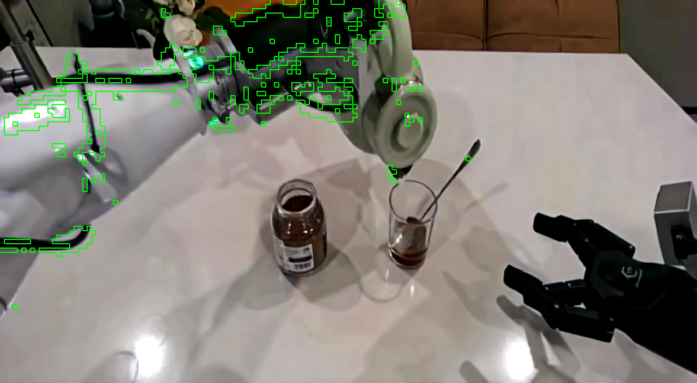

# Generation-Free Video-Diffusion Representations

Research code, diagnostics, and deployment artifacts for reusing a pretrained
Cosmos video world model without explicitly generating future video at policy
inference time.

## Problem

Video diffusion models learn spatial, temporal, and language-conditioned priors,
but multi-step video generation is expensive and does not necessarily produce
the best representation for a downstream decision policy. This project asks:

> Can a policy consume pretrained video-model latents directly, while asynchronous
> action-chunk execution keeps the world model outside the control critical path?

This is a representation-reuse and systems project. It does not claim to reduce
the FLOPs of Cosmos itself.

## Approach

```text
RGB history + instruction + robot state
                    |
          frozen Cosmos-Predict2
                    |
       VAE latent / Transformer hidden
                    |
        lightweight policy adapter
                    |
      async action chunk + RTC handoff
```

The work has three stages:

1. diagnose whether temporal latent changes retain spatial motion information;
2. test whether short-chain denoising improves causal or probe-level dynamics;
3. integrate clean latents into a closed-loop policy with asynchronous inference.

## Key Evidence

### Latent motion locality

For one saved frame pair, the channelwise latent L2 delta was compared with the
decoded RGB-change map on the same `88 x 160` spatial grid.

| Metric | Result | Random reference |
|---|---:|---:|
| Spearman correlation | 0.350 | approximately 0 |
| Top-5% cell overlap | 64.3% | 5.0% |
| Top-5% IoU | 0.474 | 0.026 |



This is a single-pair representation diagnostic. It supports spatial locality and
motion sensitivity, not VAE linearity, semantic disentanglement, causal future
prediction, or downstream policy benefit. The metric is reproducible with
[`tools/analyze_latent_motion.py`](tools/analyze_latent_motion.py); the saved
summary is [`single_pair_metrics.json`](results/latent_motion_probe/single_pair_metrics.json).

### Closed-loop system configurations

Two `adjust_bottle` configurations were evaluated for 100 DOMINO episodes:

| Configuration | Execution | Success | Model inference p50 | Step latency p95 |
|---|---|---:|---:|---:|
| clean latent | async + RTC | 18/100 | 92.2 ms | 124.7 ms |
| CFG=7, sigma=1, K=3 | synchronous | 14/100 | 447.7 ms | 764.8 ms |

The clean async run returned completed chunks with a median three-control-step
delay; RTC compensated stale prefix actions and blended overlapping old/new
chunks. See [`integrations/starvla_domino`](integrations/starvla_domino) and the
[`async evaluation summaries`](results/async_domino_eval).

These configurations change both execution mode and denoising. Their latency and
success differences are configuration-level observations, not causal estimates
of either asynchronous execution or denoising alone.

## Negative Findings That Shaped The Design

A strong project result here is the decision to stop treating truncated generation
as a default acceleration method:

- Across 240 history/sigma/step causal combinations, no short-chain future latent
  beat the repeat-last latent baseline.
- CFG and a quality negative prompt improved the best gain to `-0.4099`, but did
  not reverse it.
- In the native-scheduler DOMINO probe, all 225 denoising layer/horizon
  combinations were less readable for future UV than the raw representation.
- Frozen raw tokens made robot-arm motion much more readable than object motion:
  arm-position L2 improved 27.0% over persistence, while object position and
  velocity improved only 0.72% and 1.17%.

The supported conclusion is narrow: under the tested settings, clean/raw
representations were more useful than naively truncated denoising for the chosen
readouts. It is not a claim that Cosmos cannot generate or model dynamics.

## What This Repository Demonstrates

- reconstruction of Cosmos preconditioning and native scheduler behavior;
- causal controls that separate noised-ground-truth recovery from future prediction;
- latent and hidden-state probes with persistence baselines and temporal alignment checks;
- integration of video-model features into a multimodal action policy;
- asynchronous websocket inference, action-chunk buffering, delay compensation,
  RTC handoff, and per-step latency instrumentation;
- analysis of negative results and experimental confounders.

## Repository Layout

```text
experiments/                 probe and sweep implementations
integrations/starvla_domino/ async action-chunk/RTC deployment snapshot
results/                     lightweight metrics and figures
tools/                       offline latent and log analysis
docs/                        full notes, provenance, and reproduction limits
```

Large model weights, datasets, latent caches, and checkpoints are intentionally
excluded. Start with [`docs/REPRODUCIBILITY.md`](docs/REPRODUCIBILITY.md) before
running model-dependent experiments.

## Limitations

- The quantitative latent-locality result currently covers one saved frame pair.
- The 18% and 14% runs are different system configurations, not a one-variable A/B.
- Closed-loop success is from one task and does not establish generalization.
- The native UV evaluator has a known cross-batch weighting issue; those absolute
  MAE values remain archival rather than headline results.
- Several exploratory sweeps selected configurations on the test set and lack
  multi-seed confidence intervals.

The two highest-value follow-ups are deliberately small: extend locality metrics
to 10-20 frame pairs, and run a 3-5 episode matched sync/async latency A/B with
the same checkpoint and seeds.

## Documentation

- [Project story, resume bullets, and interview answer](docs/PROJECT_STORY_ZH.md)
- [Full Chinese experiment summary](docs/EXPERIMENT_SUMMARY_ZH.md)
- [Reproducibility notes](docs/REPRODUCIBILITY.md)
- [Artifact provenance](docs/PROVENANCE.md)
- [Figure inventory](docs/FIGURE_INDEX_ZH.md)

## License

Original code in this repository is released under the MIT license. The copied
StarVLA integration retains its upstream MIT notice. External Cosmos, DOMINO,
and StarVLA assets remain subject to their own licenses and terms.
